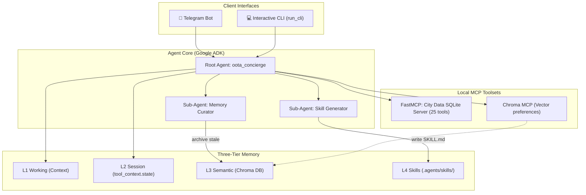

# Kaggle Submission Writeup: Oota & Commute

## Title: Oota & Commute — The Privacy-First India Urban Concierge Agent
### Subtitle: A self-improving, locally-encrypted concierge agent for Indian city logistics, transit routes, group midpoints, and expense splitting built on Google ADK & FastMCP.

---

## 1. Selected Track: Concierge Agents

**Oota & Commute** belongs in the **Concierge Agents** track. It serves as a personal virtual assistant that solves daily transit, social coordination, and local budgeting challenges in Indian cities. More importantly, it enforces a zero-cloud-leak privacy model where all user locations, schedules, preferences, and expense ledgers are stored and processed locally on the user's host machine.

---

## 2. Problem Statement

Living and traveling in major Indian cities (e.g. Bengaluru, Mumbai, Delhi) presents complex, highly dynamic challenges:
- **Spatial Chaos**: Coordinating social meetups across huge distances with heavy traffic congestion (like the Outer Ring Road or Silk Board in Bengaluru) requires calculating optimal travel times and geographic midpoints.
- **Intermodal Transit Delays**: Commuters need to calculate exact metro fares, platforms walk delay factors (such as the 6-minute walk time at Majestic station in Bengaluru), and estimate auto-rickshaw meter rates vs. ride-hailing surges.
- **Logistical Overhead**: Managing temple dress codes, darshana wait times, weather rain warnings, shared expense splits, and shopping directories across multiple floors of modern malls.
- **Privacy Trade-off**: Existing concierge assistants leak personal logs, schedules, and daily locations to cloud-hosted analytics platforms.

---

## 3. The Solution: Oota & Commute

**Oota & Commute** acts as a localized concierge running on a user's local hardware or private home lab. It uses a hybrid routing engine to redirect basic transactions (like ledger splits or status queries) to a local Ollama instance, reserving complex planning tasks for Gemini. 

Key capabilities:
1. **P2P Group Centroid Solver**: Recommends optimal meeting spots near metro stations for 3+ users based on coordinates.
2. **Commute Estimator**: Snaps coordinates to transit stations, calculates platform walking overheads, and estimates rickshaw fares.
3. **Micro-Climate Rain Alerts**: Monitors neighborhood precip forecasts and proactively suggests indoor mall backups for outdoor park dates.
4. **Expense Split Ledger**: Automatically splits bill expenses and tracks net debts locally.
5. **Secure Local Vault**: Encrypts SQLite databases and Chroma collections at rest using local Fernet keys.

---

## 4. Key Concepts Demonstrated (Evaluation Matrix)

### A. Agent / Multi-Agent System (ADK)
- **Root Agent**: The `oota_concierge` root agent manages incoming conversation context.
- **Skill Generator Sub-Agent**: Triggered automatically when a task executes ≥5 tool calls. It reflects on successful procedures, crystallizing them into a reusable `SKILL.md` playbook in `.agents/skills/auto/`.
- **Memory Curator Sub-Agent**: Runs periodically via cron, auditing Chroma preferences and skill usage records. It transitions inactive data: `Active -> Stale (30 days) -> Archived (90 days)` without deleting data.

### B. MCP Server
- **FastMCP Data Server (`city_data_server.py`)**: Houses 25 custom tools written in Python. Exposes SQLite relational mappings for cities, neighborhoods, points of interest, metro transit stations, and weather forecasts.
- **Chroma MCP**: Connects the agent to local semantic memory.

### C. Security Features
- **Zero Cloud Leakage**: No calendar entries, split details, or coordinates leave the local network. Only model queries are processed.
- **Fernet Vault Encryption**: The `manage_vault_encryption` tool encrypts the relational database file at rest.

### D. Deployability
- **Docker & Compose**: Containerizes the gateway webhooks and FastMCP database with volume mounts.
- **Kubernetes Manifests**: Includes deployments with readiness probes, PersistentVolumeClaims (PVCs) for SQLite/Chroma directories, and ConfigMaps/Secrets for token management.

---

## 5. System Architecture



---

## 6. How to Run Locally

```bash
# 1. Clone repository & configure env
git clone https://github.com/your-org/oota.git && cd oota
cp .env.example .env  # fill in GOOGLE_API_KEY and encryption keys

# 2. Install package
pip install -e .

# 3. Seed database
python data/seed_database.py

# 4. Start local agent
python main.py
```
*If `TELEGRAM_BOT_TOKEN` is unset, the launcher boots the awaited `run_cli` interactive shell.*
